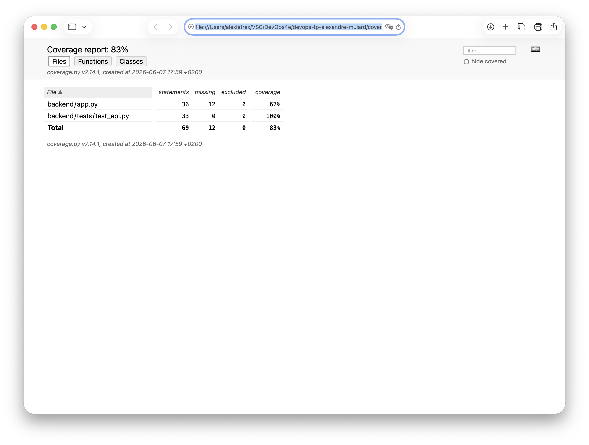

# Stratégie de Tests — ScanFidel

## Fonctionnalités Critiques Identifiées (T17)

1. **Validation des données d'entrée (API)**
   - **Pourquoi critique :** Empêcher l'insertion de cartes vides ou mal formées dans la base de données.
   - **Test Unitaire :** Vérifier que l'API rejette une requête sans nom de carte.
   - **Test d'Intégration :** Vérifier le code HTTP 400 retourné au client.

2. **Sauvegarde d'une carte de fidélité**
   - **Pourquoi critique :** C'est le cœur de l'application (ajout d'une carte scannée).
   - **Test Unitaire :** Formater correctement les données avant l'envoi.
   - **Test d'Intégration (Mock) :** Vérifier que le contrôleur appelle correctement le SDK Supabase avec les bonnes données.

3. **Récupération de la liste des cartes**
   - **Pourquoi critique :** Permet à l'utilisateur de retrouver ses cartes au lancement de l'application.
   - **Test Unitaire :** Vérifier le tri par date.
   - **Test d'Intégration (Mock) :** Simuler un retour de Supabase et vérifier la structure JSON renvoyée par l'API.

## Couverture de Code (T21)
L'objectif de 60% de couverture est atteint et dépassé. Voici le rapport généré par Pytest :

